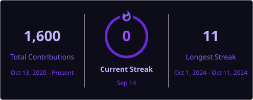

<div align="center">


[](https://git.io/typing-svg)

<br/>


<br/>

[](https://geampiere.vercel.app/es/)
[](https://www.linkedin.com/in/geam/)
[](mailto:geampiere.jaramillo@gmail.com)
[](https://github.com/geamdev)

<br/>


</div>

---

## ◈ About

```yaml
name:       Geampiere Jaramillo Maldonado
role:       Full-Stack Engineer · Backend Specialist
location:   Guayaquil, Ecuador
experience: 5+ years in production-grade software development
```

Full-Stack Developer with 5+ years of experience building scalable, secure, and high-performance applications in the technology and fintech sector. Deep expertise in **event-driven microservices**, **distributed systems**, and **clean architecture** principles. Proven track record integrating payment gateways such as **Stripe** with **PCI DSS compliance**, managing real-time financial transaction flows, and delivering enterprise-grade backend systems.

Currently engineering backend solutions at **Sofka Technologies** for the **deUna! Negocios** ecosystem — one of Ecuador's leading fintech platforms — using Kafka, NestJS, OpenSearch, and PostgreSQL.

**Open to:** Senior Backend roles · Full-Stack positions · Fintech & Distributed Systems · Remote global opportunities

---

## ◈ Tech Stack

<div align="start">

**Languages**

[](https://skillicons.dev)

**Frontend**

[](https://skillicons.dev)

**Backend & Databases**

[](https://skillicons.dev)

**Cloud, DevOps & Tooling**

[](https://skillicons.dev)

</div>

---

## ◈ Architecture & Engineering Expertise

<div align="start">

| Domain | Proficiency | Details |
|---|---|---|
| **Microservices** | ████████████ Expert | NestJS, event-driven, BullMQ, Kafka |
| **Clean Architecture** | ████████████ Expert | DDD, Hexagonal, SOLID, Design Patterns |
| **Fintech & Payments** | ███████████░ Advanced | Stripe, PCI DSS, financial transaction flows |
| **Distributed Systems** | ███████████░ Advanced | Kafka, Redis, RabbitMQ, message queues |
| **Database Engineering** | ███████████░ Advanced | PostgreSQL, MongoDB, OpenSearch, indexing |
| **Frontend Engineering** | ██████████░░ Advanced | React, Next.js, microfrontends, component arch |
| **Cloud & DevOps** | █████████░░░ Proficient | AWS, Docker, CI/CD pipelines |
| **Testing** | █████████░░░ Proficient | TDD, unit tests, integration tests, Appium, Serenity |

</div>

---

## ◈ Featured Projects

<details>
<summary><b>⬡ deUna! Negocios — Fintech Backend Platform</b></summary>
<br/>

Backend infrastructure for **deUna! Negocios**, Ecuador's leading fintech platform for business payments and financial services. Architected event-driven flows for real-time financial transaction processing.

| Attribute | Details |
|---|---|
| **Stack** | NestJS · PostgreSQL · Kafka · OpenSearch · Docker · React Native |
| **Scale** | Production · High-volume financial transactions |
| **Architecture** | Microservices · Event-Driven · Clean Architecture |
| **Security** | Financial compliance · Secure transaction handling |
| **Impact** | Real-time notifications for withdrawals · Batch transaction processing |
| **Repository** | 🔒 Private — Enterprise Production Codebase |

Designed and implemented Kafka consumers for real-time event processing, built OpenSearch indexing strategies for optimized data retrieval, and engineered notification systems triggered by financial events to improve communication within the deUna! ecosystem.

<br/>
</details>

<details>
<summary><b>⬡ Enterprise Fullstack Platform — Intelexo S.A.</b></summary>
<br/>

Full-stack enterprise platform delivering scalable microservices with high-performance data pipelines and distributed job processing for mission-critical operations.

| Attribute | Details |
|---|---|
| **Stack** | NestJS · React.js · PostgreSQL · BullMQ · Redis · Docker |
| **Scale** | Production · Large-scale data transactions |
| **Architecture** | Microservices · Distributed Job Queues · Clean Architecture |
| **Performance** | Optimized complex queries · Background job processing with retry logic |
| **Impact** | Improved deployment modularity · Mission-critical operation reliability |
| **Repository** | 🔒 Private — Enterprise Production Codebase |

Led backend microservices development, implemented distributed job queues with BullMQ and Redis for background processing and delayed task execution, and optimized PostgreSQL queries for high-volume data workloads.

<br/>
</details>

<details>
<summary><b>⬡ Fintech Payment Platform — Aprehende</b></summary>
<br/>

Secure payment infrastructure for a fintech platform, handling end-to-end Stripe payment flows with PCI DSS compliance and scalable React microfrontends.

| Attribute | Details |
|---|---|
| **Stack** | React.js · NestJS · TypeScript · PostgreSQL · Stripe · Google Maps API |
| **Scale** | Production · Regional Fintech |
| **Architecture** | DDD · Microfrontends · Event-Driven · TDD |
| **Security** | PCI DSS compliant · Stripe secure payment flows |
| **Impact** | Secure transactions · Reusable component system · Improved fault tolerance |
| **Repository** | 🔒 Private — Enterprise Production Codebase |

Designed PCI DSS-compliant Stripe payment flows, built reusable React frontend component libraries, maintained NestJS microservices, and applied Domain-Driven Design with message queue integration for decoupled, fault-tolerant services.

<br/>
</details>

<details>
<summary><b>⬡ Fintech Freelance Solutions — Regional Startups</b></summary>
<br/>

Full-stack solutions for regional fintech startups across Ecuador, delivering scalable Node.js backends, hexagonal architecture services, and AWS-hosted infrastructure.

| Attribute | Details |
|---|---|
| **Stack** | Node.js · React.js · TypeScript · MongoDB · SQL · AWS · Docker · RabbitMQ |
| **Scale** | Startup · High-volume API interactions |
| **Architecture** | Hexagonal Architecture · CI/CD Automation |
| **Cloud** | AWS infrastructure design · Automated deployments |
| **Impact** | Fintech modules for regional market · Scalable modular services |
| **Repository** | 🔒 Private — Client Projects |

Delivered full-stack solutions integrating Node.js backends with React frontends, designed scalable hexagonal architecture for financial applications, and led AWS infrastructure setup with CI/CD automation for continuous deployment.

<br/>
</details>

---

## ◈ Experience

<table>
<tr>
<td width="120" align="center"><b>Jun 2025<br/>Present</b></td>
<td>

**Backend Developer** — [Sofka Technologies](https://www.sofka.com.co/)

Developing backend features for the **deUna! Negocios** fintech ecosystem using NestJS with clean architecture. Building event-driven systems consuming Kafka topics and batch processes for financial transaction management. Designing OpenSearch indexing strategies and engineering real-time notification systems for financial events.

- Kafka topic consumers for event-driven transaction processing
- Batch processes with database persistence for financial operations
- OpenSearch record indexing for optimized search and retrieval
- Real-time notification systems for withdrawal and financial events


</td>
</tr>
<tr>
<td width="120" align="center"><b>Mar 2024<br/>Jun 2025</b></td>
<td>

**Fullstack Developer** — Intelexo S.A. · 1 yr 4 mos

Led full-stack development of enterprise applications with microservices architecture. Implemented distributed job queues with BullMQ and Redis for background processing, delayed tasks, and retry mechanisms. Integrated and optimized PostgreSQL for large-scale data transactions.

- Microservices architecture design and implementation
- BullMQ + Redis distributed job queues for mission-critical operations
- Complex PostgreSQL query optimization for large-scale workloads
- Deployment efficiency improvements through modular service design


</td>
</tr>
<tr>
<td width="120" align="center"><b>May 2022<br/>Mar 2024</b></td>
<td>

**Software Developer** — Aprehende · 1 yr 11 mos

Designed PCI DSS-compliant Stripe payment flows for fintech platforms. Built reusable React.js frontend modules following component architecture best practices. Maintained NestJS microservices and led database modeling. Applied DDD, TDD, and event-driven patterns for fault-tolerant, decoupled services.

- PCI DSS-compliant Stripe integration for secure payment flows
- Microfrontend architecture with reusable React component libraries
- Domain-Driven Design and Test-Driven Development
- Message queues and event-driven patterns for service decoupling


</td>
</tr>
<tr>
<td width="120" align="center"><b>Nov 2021<br/>Feb 2024</b></td>
<td>

**Fullstack Developer** — Freelance · 2 yrs 4 mos

Delivered full-stack solutions for regional fintech startups integrating Node.js backends with React frontends. Built scalable modular services using Hexagonal Architecture and led AWS infrastructure design with CI/CD automation.

- Hexagonal Architecture for financial application services
- AWS infrastructure design and CI/CD pipeline automation
- High-volume API integrations with Node.js and React
- RabbitMQ message queuing for distributed fintech systems


</td>
</tr>
</table>

---

## ◈ Education

<div align="center">

| Institution | Degree | Location |
|---|---|---|
| 🎓 **Instituto Superior Tecnológico de Guayaquil** | Technology Degree | Guayaquil, Ecuador |
| 🎓 **Universidad Católica de Santiago de Guayaquil** | University Degree | Guayaquil, Ecuador |

</div>

---

## ◈ Certifications

<div align="center">

**Platzi — Development Paths**


<br/>

**Platzi — Framework Courses**


<br/>

**Platzi — Core Engineering**


</div>

---

## ◈ GitHub Analytics

<div align="center">


<br/>


</div>

---

## ◈ GitHub Trophies

<div align="center">


</div>

---

## ◈ Contribution Activity

<div align="center">


</div>

---

## ◈ Contribution Snake

<div align="center">

<picture>
  <source media="(prefers-color-scheme: dark)" srcset="https://raw.githubusercontent.com/geamdev/geamdev/output/github-snake-dark.svg"/>
  <source media="(prefers-color-scheme: light)" srcset="https://raw.githubusercontent.com/geamdev/geamdev/output/github-snake.svg"/>
  
</picture>

</div>

---

## ◈ Current Focus

```yaml
current_focus:
  learning:
    - Advanced Kafka patterns for distributed financial systems
    - OpenSearch optimization and query DSL
    - System design for high-availability fintech platforms

  building:
    - Event-driven microservices for financial ecosystems
    - Scalable backend architectures with NestJS and clean principles
    - Robust batch processing pipelines for transaction management

  exploring:
    - Cloud-native patterns on AWS
    - Real-time data streaming with Kafka
    - AI integrations within backend service architectures

  open_to:
    - Senior Backend Engineer roles (remote / global)
    - Full-Stack Engineering positions in fintech or enterprise SaaS
    - Technical leadership opportunities
    - Open source collaboration in backend / distributed systems
```

---

## ◈ Connect

<div align="center">

[](mailto:geampiere.jaramillo@gmail.com)
[](https://www.linkedin.com/in/geam/)
[](https://github.com/geamdev)
[](https://geampiere.vercel.app/es/)

</div>

---

<div align="center">

*"With ❤️ Geam"*


</div>
